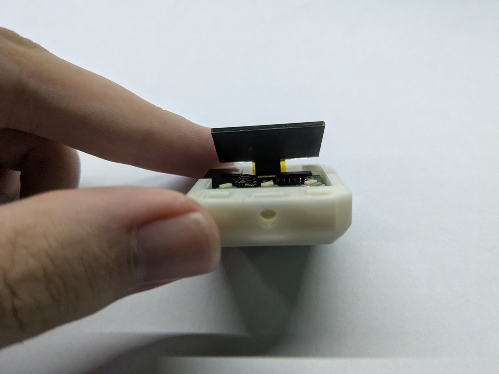
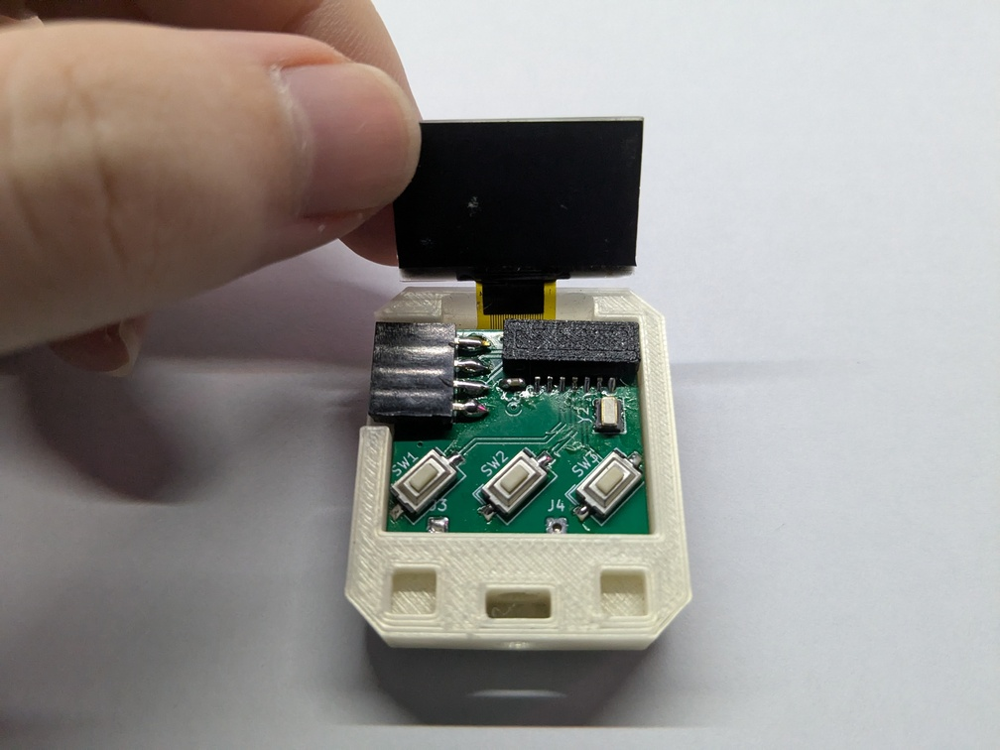
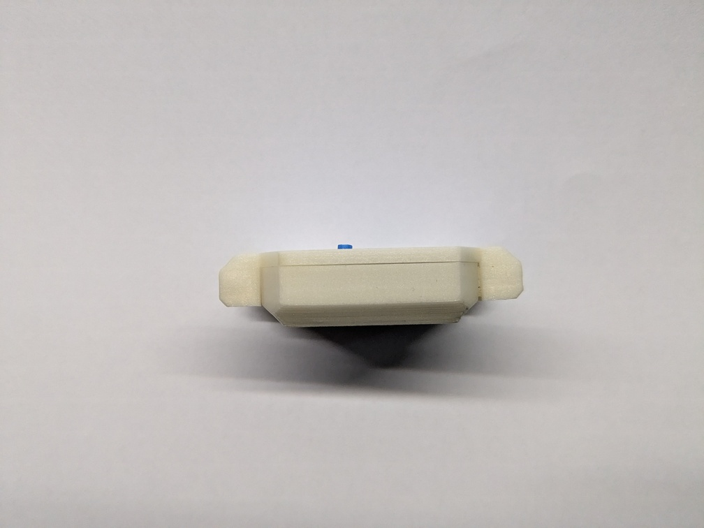

# Hardware assembly instructions

To start, you will need:

- An assembled tinyWatch mainboard.
- All 3D printed pieces (body, front, buttons (3 pcs.), OLED support piece).
- A new CR2032 battery.
- An M3 hex nut and an M3x6 screw.
- A 18 mm wide watch strap.
- Two pieces of nickel strip cut to a weird "T"-like shape (so that the middle bit is no more than 2 mm wide and about 5 mm deep).
- Two short pieces of thin wire (about 20 mm in length, I use cheap 30 AWG "wire wrapping" wire).
- Some solder.
- Some electrical tape and a small piece of double-sided tape (not in the picture).

Required tools:

- A soldering iron. You probably already have one if you were able to assemble the mainboard.
- A spot welder. I use [this cheap battery-powered one](https://www.aliexpress.com/item/1005006226735630.html), it does the job just fine.
- Some precise pliers or a sharp knife to create the nickel strips shown above.
- A screwdriver.
- (_optional_) A pair of bent tip tweezers to make placing things easier

> [!TIP] 
> If you have access to more than one color of 3D printable material,
> do not be afraid to experiment to make your watch truly unique
> (such as with the buttons colors).

## Preparing the battery

First, solder the short pieces of wire onto the middle "base" of the nickel strips.

Start by spot welding the nickel strip to the positive terminal of the battery.

Before spot welding to the bottom terminal, place a piece of electrical tape around the seam of the positive and negative terminal of the battery to prevent accidental short circuits. Place this tape 90° counter-clockwise from where the positive wire is pointing.

Then, weld the second nickel strip to the negative terminal of the battery, over the tape.

You should end up with a battery that has two wires coming out of it, offset by a 90° angle.

> [!IMPORTANT]
> Make sure that when looking at the battery with its positive terminal on the top,
> the positive wire should be 90° counter-clockwise from the negative wire.

## Installing the battery and mainboard

Bend the wires coming out of the battery upward and insert it into the main body.

Place some electrical tape over the newly inserted battery, so that it does not accidentaly short out with the mainboard during daily use.

Connect the battery to the mainboard.

> [!IMPORTANT]
> Make sure that the polarity is correct -
> the negative wire connects to the "-" terminal on the mainboard,
> while the positive wire connects to the "+" terminal.

> [!TIP]
> If your mainboard is not yet programmed, it will consume a few mA of current,
> pointlessly draining the battery. It is highly recommended to connect a programmer
> to the mainboard **now** and flash the firmware, which will also verify
> that the watch is working correctly.

Push the mainboard firmly into the body. The buttons as well as the debug/communication connector should be flush with the top of the body.

Place the OLED support piece on top of the main microcontroller with a piece of double-sided tape on it.
If you then push the OLED panel down, the support piece should stick to it.

## Final assembly

Insert the M3 hex nut into the hole in the body.

> [!TIP]
> To verify that the nut is placed correctly, you can try temporarily screwing in the screw into the body.
> It should screw in smoothly.
> 

Place the buttons into the front piece.

Now, for the tricky part - closing the entire unit. The easiest way to do this is to hold the main body vertically with the front piece "hanging" from it. This way, neither the nut nor the buttons will fall out during final assembly.

Place the OLED panel into the front piece so that the bottom of the panel is seated in the bottom of the display hole in the front piece.

Then, it should just close together without issues. Make sure that the front piece does not bulge, then screw it down into the main body.

## Strap attachment

Attaching the strap is as easy with any other watch - simply press one side of the strap's push pin into the watch, press the push pin and slide the whole strap into the watch so that the push pin locks the strap in place.

Do the same with the bottom strap.

## Finish

Congratulations, you should now have a fully functioning tinyWatch!

